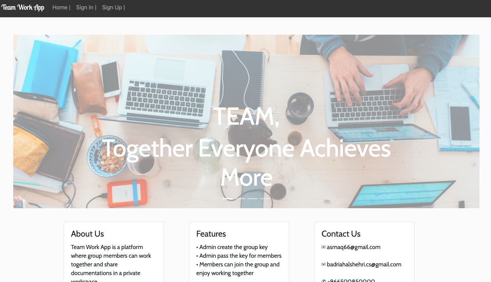

## TeamWork App:
 TeamWork App is a platform where group members can work together and join to chat room in a private workspace.

## Requirements:
* Admin create the group by group key
* Admin pass the key for members
* Members can join the group and enjoy working together
* Allow members to exit from the group

## Technologies
* React.js frontend
* Node/Express backend

## Features
* allow owner to create group by group key
* allow memeber to join to the group
* allow memeber to view all group joined
* allow member to exit from group
* Allow members to share messages in the group chat room

## The most difficult and favorite part
used the socket library for real time communication it was hard to set the all functionality in short time

## I would like to add next
* use S3 amazon to allwo member to upload image
* view the online member in the chat room
* set an expiration date for message group received

## Acknowledgments
* @MicFin
* Ghadeer Alkhathlan
* @usmanbashir
* w3schools.com
* stackoverflow.com